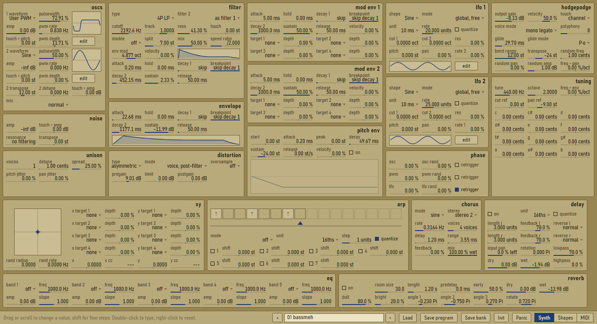

# Porridge

A Cmajor plugin that is compatible with FUzzpilz's Oatmeal VST presets

```bash
npm install
npm run build
cmaj play Porridge.cmajorpatch
```

## Interface



## Layout

```
Porridge.cmajorpatch    manifest
dsp/                    Cmajor DSP
  Porridge.cmajor         top-level graph
  ParamStore.cmajor       the parameter endpoints: Oatmeal's 342, then Porridge's own (generated)
  Slots.cmajor            parameter -> program-struct slot constants (generated)
  ModTables.cmajor        modulation sources, targets and knob laws (generated)
  Synth.cmajor            MIDI, voice manager, arpeggiator, per-voice rendering, effects chain,
                          a K-weighted level meter the view asks for (levelRequest/levelOut),
                          and reports of the sounding notes for the view (voiceView/voiceViewOut)
  Oscillator, Filter, Modulation, Effects, Tables, Voice, Types
                          (Voice.cmajor also has the key EQ: a low shelf under each voice's
                          note and bands on its harmonics; Oscillator.cmajor each oscillator's
                          roughness, noise in its phase)
  FxExtra.cmajor          Porridge's flanger, phaser, compressor, bode, rack filter and utility
  VoiceFx.cmajor          the voice lane: up to four effects in every voice, around the filter
                          and the amp envelope (the rack's filter, distortion, EQ, phaser,
                          flanger and utility, and a key-tracked frequency shifter, a
                          resonator tuned to each note and an octaver); voices ring on past
                          the amp while effects after it still sound. The phaser's and
                          flanger's LFOs can start each note at a random point and follow its
                          pitch, the flanger's delay its period
  Space.cmajor            the algo reverb (hall, plate, nitrous, basin, vintage)
  Ambience.cmajor         the ambience: very small spaces (room, and Airwindows' ClearCoat
                          and VerbTiny), for a little stereo and tone
  Airwindows.cmajor       ports of Airwindows plugins: the distortion's model types (Tube,
                          Tape, Density, Mackity, Edge, MultiBandDistortion, Fracture2,
                          BassAmp, GrindAmp, Beam, BitGlitter, whose rates can land on
                          multiples of a voice's note) and the air rack effect (Air4)
  Convolve.cmajor         the convolver: zero-latency partitioned convolution, built-in impulses
ui/                     patch view (ReScript)
  Index.res               entry point; View.res builds the header (pages, program, the ≡ menu),
                          the four pages and the shapes editor over them (ShapesOverlay.res),
                          and binds undo and redo: ParamModel.res records every edit, a
                          gesture a step, and ProgramStore.res whole-program changes
  PagePlay.res            the Play page: macros, arpeggiator, XY pad, wheels and the MIDI input
                          (MidiInput.res); SlotRows.res shows target slots as used rows + "+"
  VoiceView.res           the sounding notes as the DSP reports them: a mark per note on the
                          envelopes, LFOs, the filter graph and the modulated controls
  Preset.res              Porridge's preset format; PorridgeParams.res and ModMatrix.res
                          list the parameters and modulation sources/targets Oatmeal doesn't have
                          (32 connections, each with hold, slew, curve and steps; per-note
                          sources include chord position, gap, legato and the sounding
                          pitch); ModScope.res says
                          which sources each note has its own of and which targets are in the
                          voice or on the whole sound, for PageMod.res (the Mod page);
                          Modulators.res says what moves each parameter (connections and
                          Oatmeal's own routings), which the parameter rows and the graphs'
                          points show in the sources' colours, and what each source moves,
                          which Destinations.res shows as chips on the source's panel;
                          ModEdit.res connects a source to a control, and ModTray.res is the
                          source tray (from the status line) whose chips drop onto any control
  PresetBrowser.res       the preset browser; Library.res searches and filters for it, and
                          BankLibrary.res asks the plugin for the banks it keeps
  random/                 random patches: RandomDrawer.res (the drawer: the wildness knobs,
                          the locks, four cards to play, keep or vary, each card's level
                          metered silently as it first plays and its output gain set from
                          that), PatchGen.res (making a patch of a kind with each area as wild
                          as its knob, varying any patch, naming and describing one, and an
                          estimate of its level), LevelTables.res (what the estimate knows
                          of the synth's levels, measured by tools/random-levels.mjs)
  NewBankDialog.res       starts a new bank of Init programs, for someone writing one
  VoiceLane.res           editing the voice lane (FxRack.res reads it beside the rack): its
                          effects in order with the filter and the amp, moving an effect between
                          per-voice and the whole sound; the FX page's strip (PageFx.res: the
                          signal path, a tab per effect) and the synth page use it
  PageMain.res            the synth page: VoiceFlow.res draws the voice's signal flow along its
                          top; Features.res says which features a patch uses, which the
                          panels' tabs mark (Panel.res)
  ValueList.res           the list parameters' value lists: names, field texts, the values
                          Porridge adds, and menus by sound (families, variant chips, "more"),
                          which Menu.res shows and Controls.res' lists open
  FilterTypes.res         the filter types, and their families for the menu; FilterGraph.res
                          their response pictures, with a point to drag for cutoff and resonance
  FxPanels.res            the tabs of Porridge's own effects (CompEditor.res: the compressor's);
                          Impulse.res the convolvers' impulse files; AmbienceSim.res runs the
                          ambience's models on an impulse for its graphs; SpaceModels.res is
                          the space effects' one model list (reverb, ambience, convolution),
                          swapping an effect for another kind in its place
  DistTypes.res           the distortion's types: names, characters for the menu, what each
                          model's knobs are; DistEditor.res its tab; AirwindowsSim.res runs the
                          Airwindows models on a sine (and the air on sines) for their graphs
  oatmeal/                file formats, parameter table, value texts
  bindings/               Cmajor PatchConnection and browser API bindings
worker/PatchWorker.res  restores shapes/curves and installs the factory bank
bundle/                 view.js, worker.js and the factory bank as a new instance stores it
                        (factory-bank.json), built by `npm run build`
presets/oatmealprs.dat  Oatmeal's factory bank
presets/vanilla.porridge  Porridge's own bank (built by tools/vanilla-bank.mjs)
docs/internals/         reverse-engineering notes on the original
tools/
  gen.mjs                 regenerates ParamStore/Slots/ModTables from the parameter tables, and
                          the test host's field table and manifest
  bundle.mjs              bundles the compiled view and worker into bundle/
  random-levels.mjs       measures the synth's levels for the random patches' estimate, K-
                          weighted (--tables writes ui/random/LevelTables.res: waves, noise,
                          each filter type, each distortion type's curve) and fits the
                          estimate's weights to renders of random patches (uses the test host)
  clap/                   the C++ clap-patch.mjs adds: PorridgeBridge.h (settings, the host's
                          menu, the view's requests), PorridgeLibrary.h (the bank library:
                          bank folders scanned and copied, files opened in the browser kept)
  clap-patch.mjs          patches the generated CLAP wrapper: aspect-locked resizing, the
                          interface size setting, the host's parameter menu, the
                          64-sample latency, and a faster start (a QuickJS worker, one
                          rebuild per activation)
  clap/PorridgeBridge.h   the settings file, zoom and host menu code clap-patch.mjs adds
  sync-dir.mjs            copies the regenerated CLAP project over the old one, touching only
                          what changed
  test/                   native C++ test host built from the patch (cmaj generate --target=cpp),
                          golden.mjs (bit-exact factory renders, in Oat mode), presets.mjs
                          (format round trips), pickers.mjs (every list value maps to and
                          from its menu), library.mjs (the preset browser's search),
                          smoke.mjs (Porridge's own effects and filter types sound, stay
                          bounded and fall silent, the ambience's models and the distortion's
                          types too, and the distortion's mix lines up with oversampling; the
                          oscillator envelopes and the noise source; the key EQ's bands and
                          shelf; oscillator roughness; osc 2 heard in PM),
                          host.cpp's --time prints the render's own CPU time, for benchmarks;
                          banklibrary.cpp (the plugin's bank library on real files), oneshot.mjs (one-shot LFOs hold their
                          end), levels.mjs (the Vanilla bank's gains, levels and motion),
                          random.mjs (random patches: sound values, the wildness knobs, the
                          locks, varying the banks, and their levels), modulation.mjs (the
                          matrix's hold, slew, curve, later sources and slots, and what
                          per-note sources follow on the whole sound, and the view's reports of
                          the sounding notes, which the host writes with --voices), lane.mjs
                          (the voice lane's effects, its key tracking, tails and amp place),
                          extras.mjs (chord position, gap, legato, pitch, steps, the random
                          starts, rate and delay tracking, the lo-fi tracking, the octaver);
                          lib.mjs has what they
                          share
  vanilla-bank.mjs        builds presets/vanilla.porridge
  re/                     comparisons against Oatmeal.dll (32-bit Python) and data checks
  ui-preview/             runs the view in a browser with a mock PatchConnection
```

## Credits

Oatmeal and its factory bank (`presets/oatmealprs.dat`) authored by Fuzzpilz. 
Porridge is not affiliated with Fuzzpilz.

The ambience's clear coat and verb tiny models are ports of Airwindows ClearCoat and VerbTiny
by Chris Johnson ([airwindows/airwindows](https://github.com/airwindows/airwindows), MIT licence),
as are the distortion's model types (Tube, Tape, Density, Mackity, Edge, MultiBandDistortion,
Fracture2, BassAmp, GrindAmp, Beam and BitGlitter, under plainer names) and the air effect (Air4).
Porridge is not affiliated with airwindows.
